## **Final Project - Road Sign Classification**

    • Nicolas Macian:
Nicolas initiated the modelling phase of the project by researching, selecting and implementing and training the baseline model.
In the stages after that he implemented the VGG16 Model with transfer learning and hyperparameter tuning. 

    • Akiva Crouse:
Akiva researched viable datasets which would fit the problem task. After which he prepared the EDA on the chosen dataset. 

    • Yossi Golan (yossigolan@gmail.com): 
Yossi prepared and trained the CNN model. He also created the APP to serve the model for demonstration.

    • Doron Ben Chayim:
Doron contributed to EDA and experimented with other models.

### 1. Background

In the age of autonomous vehicles, the ‘ego’ (the autonomous vehicle decision making brain) has to perceive and analyse its environment. The vehicle’s environment is highly complex with other vehicles, pedestrians, lanes, obstacles etc. However certain objects which the vehicle needs to perceive actually give additional information on how the vehicle should behave such as traffic lights and road signs.

Road sign perception needs to broken down into several tasks, the two most basic tasks involved:
    1. The ego needs to detect and locate any road signs,
    2. The ego needs to classify the road signs so that it understands how it needs to behave.
The goal of this project is to create a model that can correctly detect and classify a multitude of road signs such that a self-driving vehicle will be able to respond accordingly. This project explores the implementation of neural networks to achieve high accuracy for computer vision-based problems.

### 2. Technical Description

        2.1. The Dataset
There are several open source dataset for road sign detection and classification, however many of the datasets have limited labelling. The labelling is labelled per category such as road sign shape or color as opposed to actual road sign identifications. These databases are effective for implementing road sign detection and location but do not serve the full purpose for road sign classification.
For this project we are using the GTSRB - German traffic sign dataset from Kaggle (GTSRB - German Traffic Sign Recognition Benchmark) which contains more than 50,000 images of 42 road signs used in Germany.
The data set is provided with Train.csv and Test.csv files. These files contain selected info regarding each image as well as the class and path in which to load the .png image file.
What is important to note is that there is no standard image size in the data set and that each road sign may have a different location or orientation within the image frame. 
This information is recorded in the Train.csv and Test.csv files but is not used as part of the modeling except for image extraction using the relevant path.
The following data dictionary is relevant to the Train.csv and Test.csv files:
-   Width    Width of image 
-   Height   Height of image 
-   Roi.X1   Upper left X coordinate of sign on image 
-   Roi.Y1   Upper left Y coordinate of sign on image 
-   Roi.X2   Lower right X coordinate of sign on image 
-   Roi.Y2   Lower right Y coordinate of sign on image 
-   ClassId  Class of provided image 
-   Path     Path to provided image

        2.2. Classes
We start our data analysis by investigating the different road signs which compile the labeling for the data. Below shows graphical representations of the 43 road sign classes including their unique features such as:
    • Shape
    • Color
    • Text
    • Illustration
The classes are already label encoded with integers from 0 to 42.:

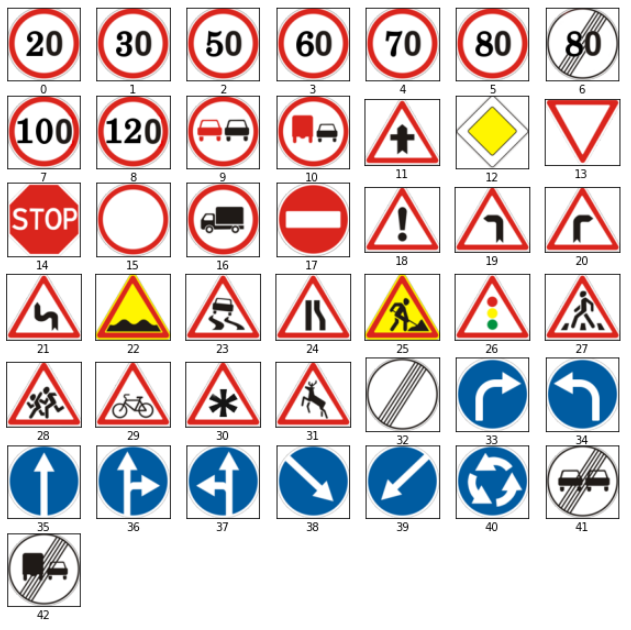

Figure 1 - Road Sign Labels

        2.3. Class Distribution
The training data set is compiled of over 39 thousand images. The plot below shows the distribution of the images per label class.

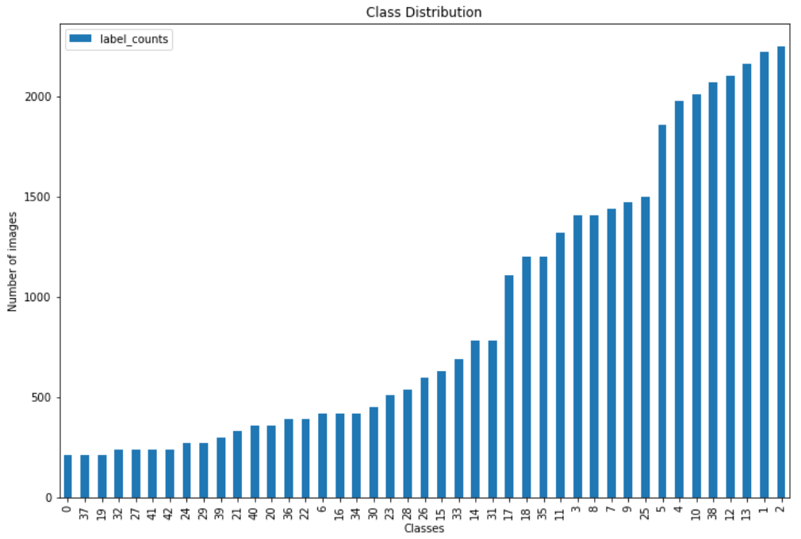

Figure 2 - Class Distribution
As can be seen, the data is unbalanced, with certain labels having counts exceeding 2000 images per class while others have less than 250.

        2.4. Image Data Inspection
Each image is resized to a constant 64 by 64 pixel image with RGB pixel color coding and loaded into an array of shape (64, 64, 3).
Now we will take a single sample image of each class for observation as shown below..

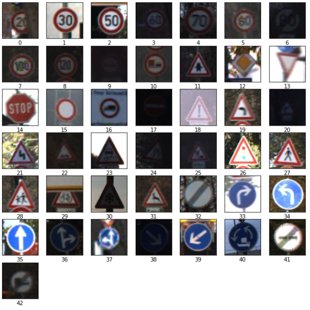

Figure 3 - Data Samples

We can make the following observations of the image data:
    • The image clarity varies.
    • The road sign angular orientation varies.
    • The image light exposure has a large variation from some images being so dark and some being very light that it’s hard to see the road sign in either extreme condition.
    • Some road signs may be obscured or blocked.
    • The road sign image area varies.
We will now show several samples of the same class in the order that the data is presented and repeat this for 4 classes.
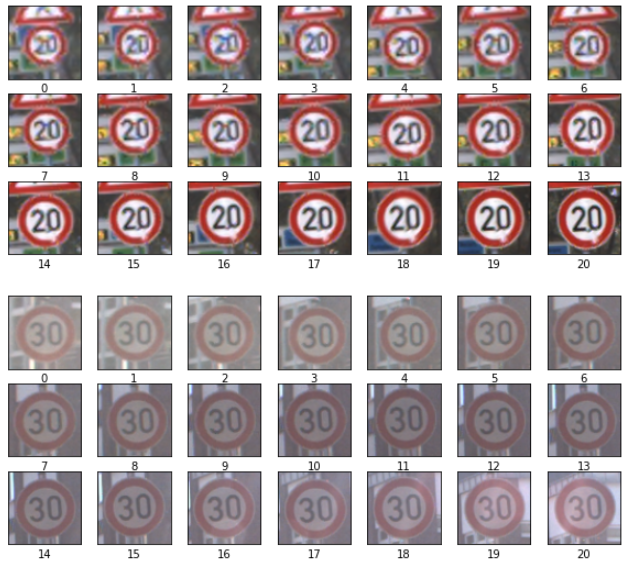
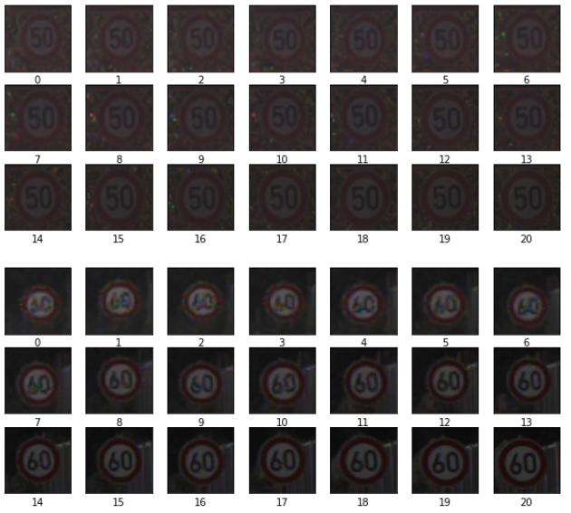

Figure 4 - Data Samples per Class

We see that many of the images are in fact taken from the same picture with variation only in size, color and light saturation. From this we can conclude that data has already been processed with data augmentation.
This may present a problem of data leakage between train and validation sets if the variation between the images are too small. It may also lead to the model learning on the image background as opposed to the road sign itself.
It also limits any further data augmentation we may like to apply on this data set.

        2.5. Original Image Size Analysis
The plot below shows the KDE plot for the width and height of all the raw images in the train set. We can see that the distribution between them is very similar, however it has been calculated that  only 20% of the images are a perfect square. This concludes that there may be some distortion of the image during resizing however it should be negligible in most cases.

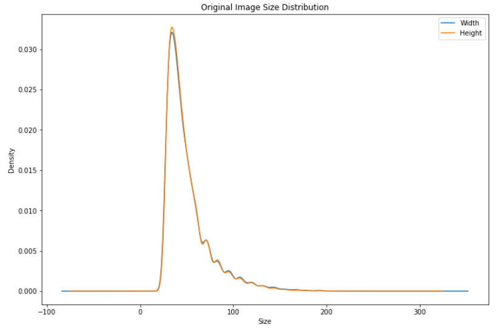

Figure 5 - Original Size Distribution

        2.6. Traffic Sign Shape Distribution

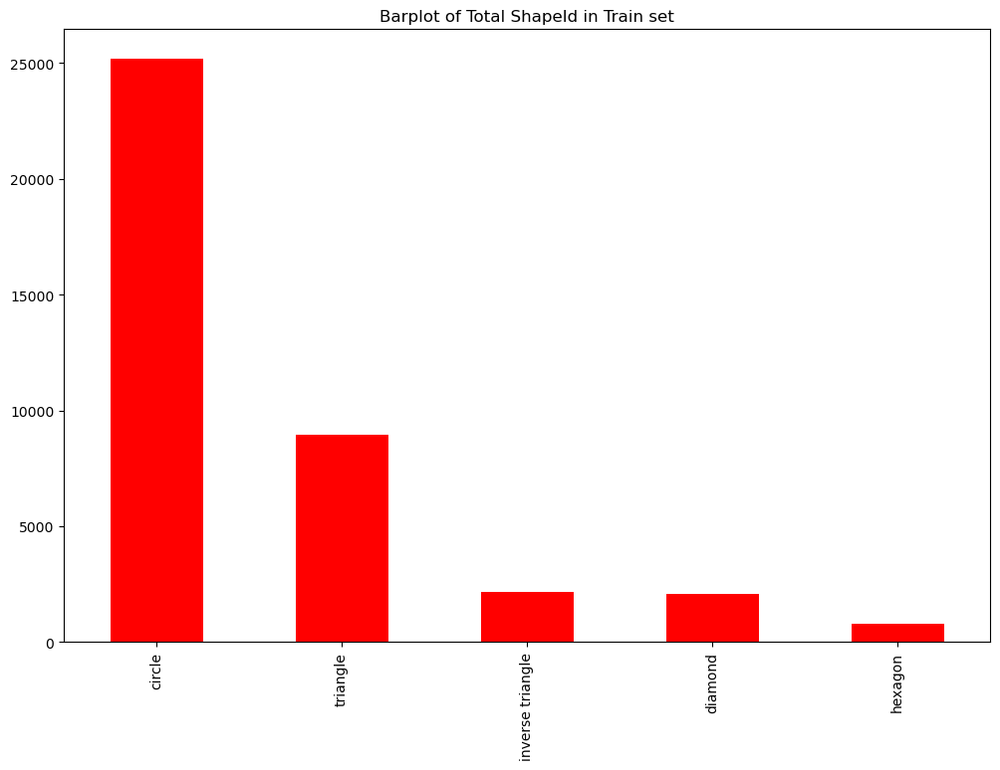

Figure 6 below shows a bar plot that represents the total number of each sign shape distributed within the train set. We can see from the graph that the most common shapes are circles followed by triangle (which consists of normal and inverse triangle), diamond then hexagon. This distribution aligns with the total shape distribution within the different classes, which can be seen in table 1.
Figure 6- Bar plot of ShapeId in the train set

Table 1- Total Shape count by class

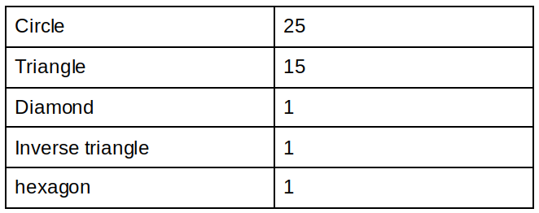

        2.7. Traffic Sign Color Distribution
In figure 7, we can see the color distribution of the signs in the train set. The most common color is red followed by blue, yellow then white. The fact that red is the most common color makes sense, since red generally is used to highlight danger or warnings, which is the purpose of street signs. Table 2 shows the total color distribution per class. We can see that the distribution per class aligns with the distribution within the train set. 

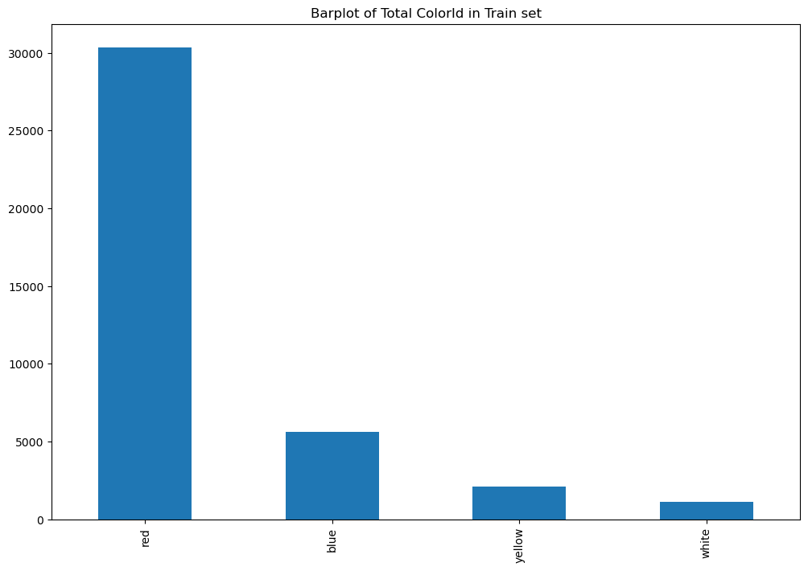

Figure 7- Bar plot of colors in the train set

Table 2-  Total color count by class

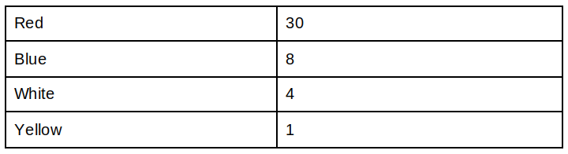

        2.8. Models
	
            2.8.1. Model 0 - Baseline
We have created a Baseline Model for our task so we can later compare our implementation to this base one. For this task, we'll use the well known VGG16 network and add some simple layers to make it adequate for our problem.
We've added a Flatten layer at the beginning of the network, followed by a Dense layer to adapt the flattened image size to the VGG16 input size. We weren't sure if we should add another Dense layer between the Flatten and the other Dense layer to improve our baseline model. We wanted to modify the original network as little as possible.

Before we define our baseline model, We'll freeze the VGG16 layers so those weights don't change during our training.

The baseline model structure is shown below:

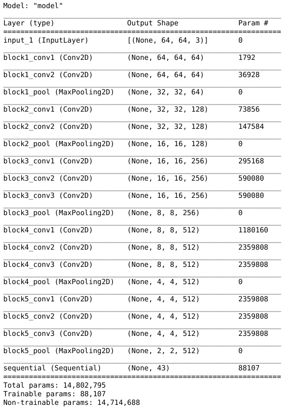

The baseline model was only trained for 3 epochs and achieved a validation accuracy of 50%.
In the following plot we can see how the accuracy and the validation accuracy evolved during training:

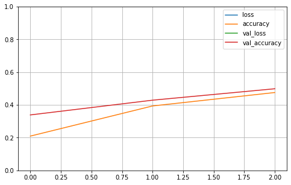

We then loaded the test data and evaluate the accuracy,
We have got an accuracy of 45.759.

            2.8.2. Model 1 - using CNN and Keras
In this model, we resize the images to a fixed size of 30x30 pixels.
The CNN model structure is shown below:

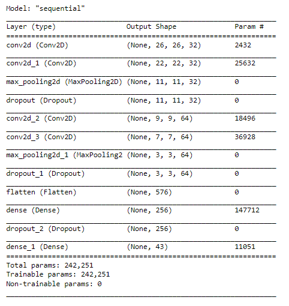

We are using the ‘adam’ optimizer, and running it with a batch size of 32 and for 15 epochs.
We can see in the two graphs below, that the accuracy and loss increase at a very fast rate during the first 3-4 epochs and then begin to remain constant, slightly fluctuating each epoch, however there is no large discernible improvement after the 4th epoch. We can see that the training values as well as the and validation values seem to correlate which suggests that the model is not overfitting or underfitting too much.  We can also notice that the accuracy has started to reach very high level - within the 90% range- which suggests the model is training acceptably but there is still some room for improvement. We can see that we have achieved much better accuracy than with the baseline model.

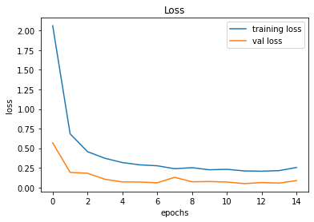

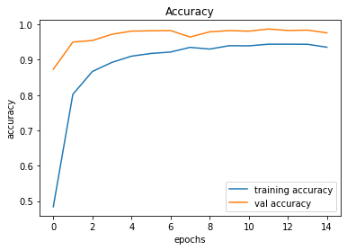

            2.8.3. Model 2 - VGG16 NN
We’ve improved our baseline model by adding one more layer to the VGG16 architecture. 

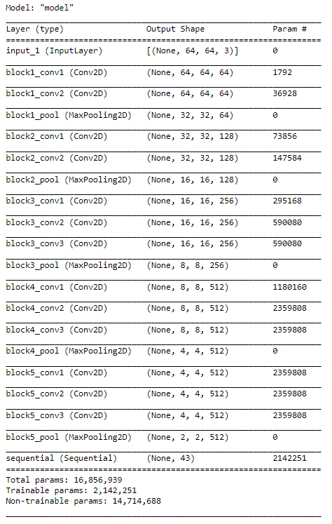

This made us achieve 0.63 test accuracy, up from 0.45 from the previous model. We can see below the loss and accuracy achieved within 5 epochs. It is evident below that the loss is decreasing both in the validation set as well as the train set, while the accuracy is increasing. The accuracy of the validation set as well as the training set managed to converge at around 5 epochs. Perhaps the accuracy and loss would be able to be improved further with a longer training time, adding more layers or even implementing early stopping. This model consisted of 5 blocks, where each block had 2-3 convolution layers and a pooling layer. 

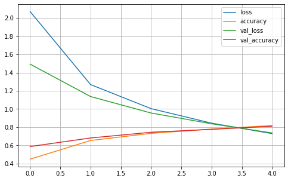

### 3. APP Deployment
	
We chose to wrap our model as an app that will fit both smartphones and computers. We wanted to give the user the ability to take road sign pictures using his camera and have the app detect the sign, or simply upload a road sign image and get a prediction.

We have chosen Gradio as the library to implement our app. Gradio allows the creation of UI apps that fit both phones and computers.

We have used a main image controller that allows taking photos in phones, or uploading pictures from a computer. We have also added some sample sign images for the user to test the app right away. Next, we have added the ability to check the model’s prediction and have a look at the ’behind the scenes’ of the model’s decision making by displaying the confidence scores.

After having our app ready, we have decided to go with heroku as our deployment server. 
The challenge we had with heroku was the limit of 500MB which didn’t let us deploy our APP.
Our model size is only 3MB, but the size of TensorFlow is more than 600MB and that was quite a problem. Eventually we found a solution:
It appears that tensorflow is implemented for both CPU’s and GPU’s, and if we take only the CPU part it will put the size of tensorflow in half.

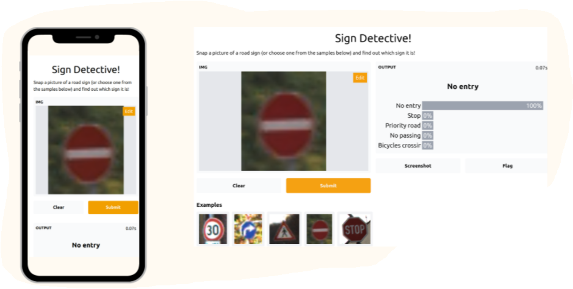

### 4. Discussion

In summation:

    • the baseline VGG16 model produced an accuracy of 47.5% on the test set,
    • the optimized VGG16 model produced an accuracy of 63.23% on the test set,
    • the CNN model produced an accuracy of 94% on the test set.

Therefore the CNN model was chosen for deployment.

During the project the following challenges were faced:

    • Finding the best dataset which had granular labelling.
    • After exploring the training data set, noticing that augmentation had already been applied on the dataset this restricted any further data augmentation.
    • In order to train the model locally, where the data was located, we had to setup CUDA in order to use keras with GPU locally.

Future steps for this project include the following:

    • Expanding the training set to include data sets from other countries besides for the German traffic sign database.
    • Developing a YOLO model for traffic sign detection.

